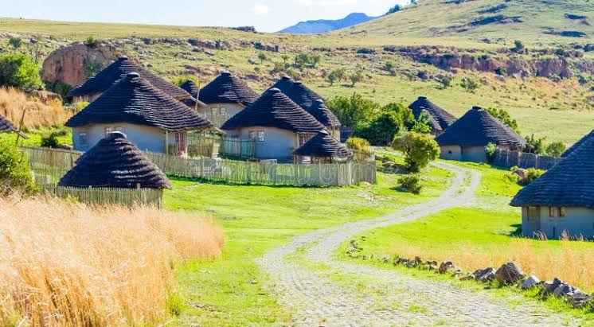

# Basotho Wool Export Analysis (2010–2024)

*Caption: Overview of Lesotho's wool export volumes.*

## Project Overview
This project presents an end-to-end Exploratory Data Analysis (EDA) of Basotho wool export data spanning from 2010 to 2024. The objective of this analysis is to uncover trends in export volumes, identify key seasonal patterns, and provide actionable insights into the agricultural economic output of Lesotho's wool industry over a 14-year period.

## Objectives
*   **Data Wrangling:** Clean and preprocess raw export data to ensure consistency and accuracy.
*   **Trend Analysis:** Visualize year-over-year growth, stagnation, or decline in wool exports.
*   **Seasonal Insights:** Identify peak export months and seasonal fluctuations.
*   **Reporting:** Generate a formal analytical report synthesizing the findings for stakeholders.

## Tools & Technologies
*   **Language:** Python
*   **Data Processing:** Pandas, NumPy
*   **Data Visualization:** Matplotlib, Seaborn, Plotly

## View the Notebook
This project was developed and executed on Kaggle. Since the data processing and visualizations rely on the Kaggle environment, you can view the fully executed notebook and fork the code directly via the link below:

**[Explore the complete Kaggle Notebook here](https://www.kaggle.com/code/arnoldaijuka/basotho-wool-dataset)**
